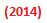

=============
reST advanced
=============

This is text under the title of the page

Images
------

.. |Infor| image:: res/Info_11pt.png

Here's an image: 

.. image:: res/Info_11pt.png

.. note::

    7412  Compilation (Behavioral) 
      Does the thing with the thing

    8222  QueryExec
      Creates a clone of Bob Ward and assigns him to your toughest problem.

These Flags
-----------

Another flag ``Doc2008`` *Info*  
	920093_: descriptions before a warning.
	
	.. warning::
	
		This flag should not be used with toast and jam.
		
	ThirdLink_ | FourthLink_ | FifthLink_ 
	
	

   
   
   
   
 .. _920093: https://support.microsoft.com/en-us/kb/920093
.. _CSS1: https://blogs.msdn.microsoft.com/psssql/2016/11/15/unable-to-drop-a-user-in-a-database/
.. _CSS2: https://blogs.msdn.microsoft.com/psssql/2016/11/15/unable-to-drop-a-user-in-a-database/
.. _ThirdLink: http://www.python.org
.. _FourthLink: http://www.python.org
.. _FifthLink: http://www.python.org
		
		
		
Other stuff
-----------

:FieldList:		This is an example of a field list. Link to Python_.

:FieldList2:	Is this useful to me? I think Github renders this as a table, annoyingly.

				Here's a second paragraph for FieldList2. Link to Python_.
				
This line inserted to break up the field lists.

:Hello: This field has a short field name, so aligning the field
        body with the first line is feasible. Link to Python_

:Number-of-African-swallows-required-to-carry-a-coconut: It would
    be very difficult to align the field body with the left edge
    of the first line.  It may even be preferable not to begin the
    body on the same line as the marker. Link to Python_ 
	
	
	
Here's an option list. It renders beautifully in both RTD and GitHub: 

	-a  command-line option "a"
	-b file   another option with an argument
	--long    a long option
	--long=file  long options can have arguments also
	/V    DOS-style argument 
	
	
Simple table:

====================  ==========  ==========
Header row, column 1  Header 2    Header 3
====================  ==========  ==========
body row 1, column 1  column 2    column 3
body row 2            Cells may span columns
====================  ======================

Complex table:	

+-----------+---------------------------------------------------------------------------------+
| Flag      | Description                                                                     |
+===========+=================================================================================+
| 243       | |D2014| |Infor| Lots of text. Lots of text. Lots of text. Lots of text. Lots of |
|           | Lots of text. Lots of text. Lots of text. Lots of text. Lots of text. Lots of t |
+-----------+---------------------------------------------------------------------------------+
| 1483      | |D2014| |Infor|  Some text                                                      | 
+-----------+---------------------------------------------------------------------------------+
| 243       | |D2014| |Infor| Lots of text. Lots of text. Lots of text. Lots of text. Lots of |
|           | Lots of text. Lots of text. Lots of text. Lots of text. Lots of text. Lots of t |
+-----------+---------------------------------------------------------------------------------+
| **10205** | |D2014| |Infor| Lots of text. Lots of text. Lots of text. Lots of text. Lots of |
|           | Lots of text. Lots of text. Lots of text. Lots of text. Lots of text. Lots of t |
+-----------+---------------------------------------------------------------------------------+

.. note:: note text

   This is a note.
   
.. attention:: attention text

   This is an attention.
   
.. caution:: caution text

   This is a caution.
   
.. danger:: danger text

   This is a danger.
   
.. error:: error text

   This is an error notice
   
.. hint:: hint text

   This is a hint notice.
   
.. important:: important text

   This is an important notice.
   
.. tip:: tip text

   This is a tip.
   
.. warning:: warning text

   This is a warning.
   
.. admonition:: admonition text

   This is an admonition.
   
intervening normal line
   
.. topic:: Topic Title

    Subsequent indented lines comprise
    the body of the topic, and are
    interpreted as body elements.
	
intervening normal line

.. sidebar:: Sidebar Title
   :subtitle: Optional Sidebar Subtitle

   Subsequent indented lines comprise
   the body of the sidebar, and are
   interpreted as body elements.
   
intervening normal line
   
   
"To Ma Own Beloved Lassie: A Poem on her 17th Birthday", by
Ewan McTeagle (for Lassie O'Shea):

    .. line-block::

        Lend us a couple of bob till Thursday.
        I'm absolutely skint.
        But I'm expecting a postal order and I can pay you back
            as soon as it comes.
        Love, Ewan.
		
		
intervening normal line
		
.. epigraph::

   No matter where you go, there you are.

   -- Buckaroo Banzai
   
intervening normal line

.. compound::

   The 'rm' command is very dangerous.  If you are logged
   in as root and enter ::

       cd /
       rm -rf *

   you will erase the entire contents of your file system.
   
intervening normal line
   
.. container:: custom

   This paragraph might be rendered in a custom way.

intervening normal line   
   
   
.. list-table::
   :widths: 15 10 30
   :header-rows: 1

   * - Treat
     - Quantity
     - Description
   * - Albatross
     - 2.99
     - On a stick!
   * - ThirdLink_
     - 1.49
     - If we took the bones out, it wouldn't be
       crunchy, now would it? Now, would it? Now, would it?
   * - Gannet Ripple
     - 1.99
     - Python_